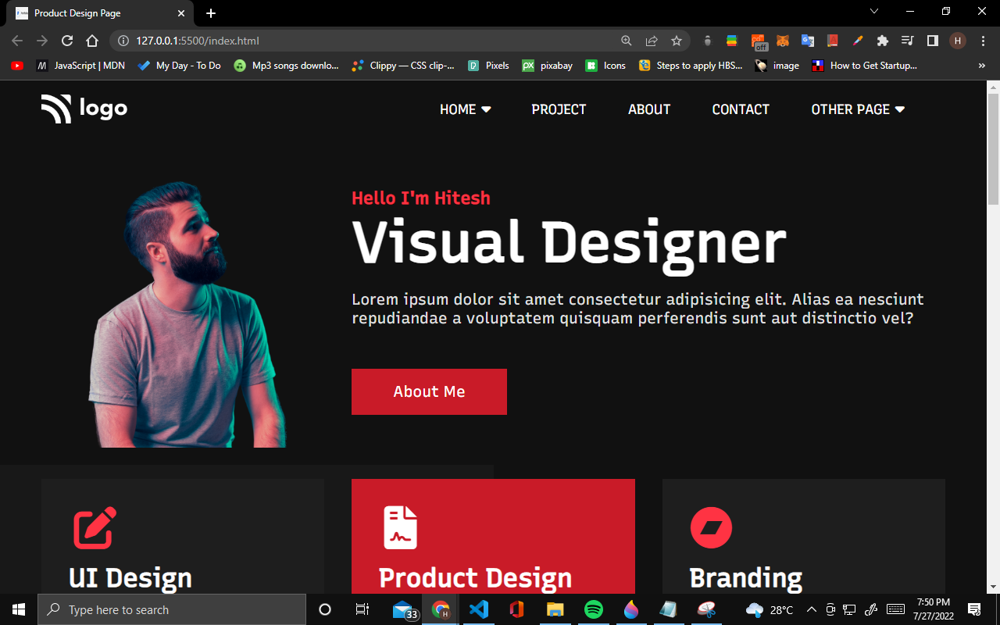
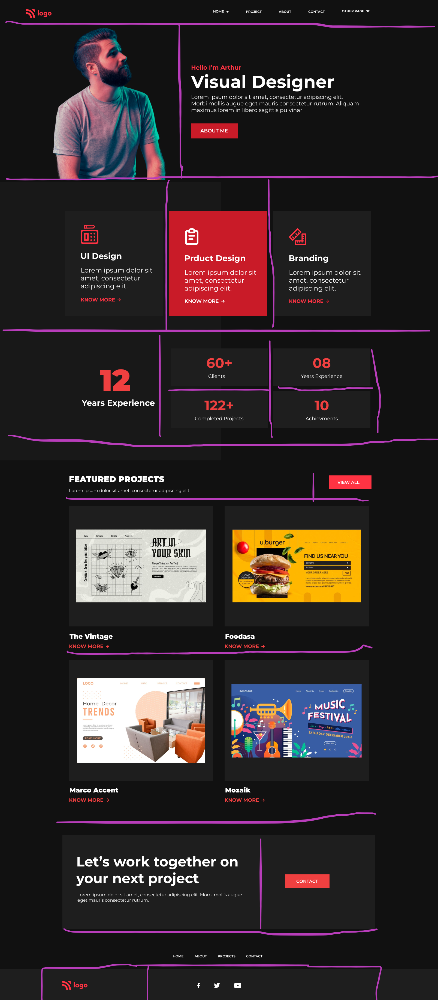

# Project 15 Product Design Landing Page

## Hey there, I am Hitesh Pal

I have build this Product Template with my core HTML CSS skills

You can check out the full version here: [Product Design Landing Page By Hitesh](https://product-landing-page-by-hitesh.netlify.app/)

## What i have learned from this project

    - In this project I have learned how to use HTML and css to Portfolio like templates.
    - How to use flex-box,3 grid,positioning and proper alignment of elements in the DOM.
    - how to use font awesome and integrate in HTML CSS. 
    - How to approach the project in while building.

## My Approach

This was my approach while building the template.

## This project took me around 4 hours approximately.

### Connect with me 
[Twitter](https://twitter.com/HiteshP25522550) 
[Linkdin](https://www.linkedin.com/in/hitesh-pal-8379011ab/)
